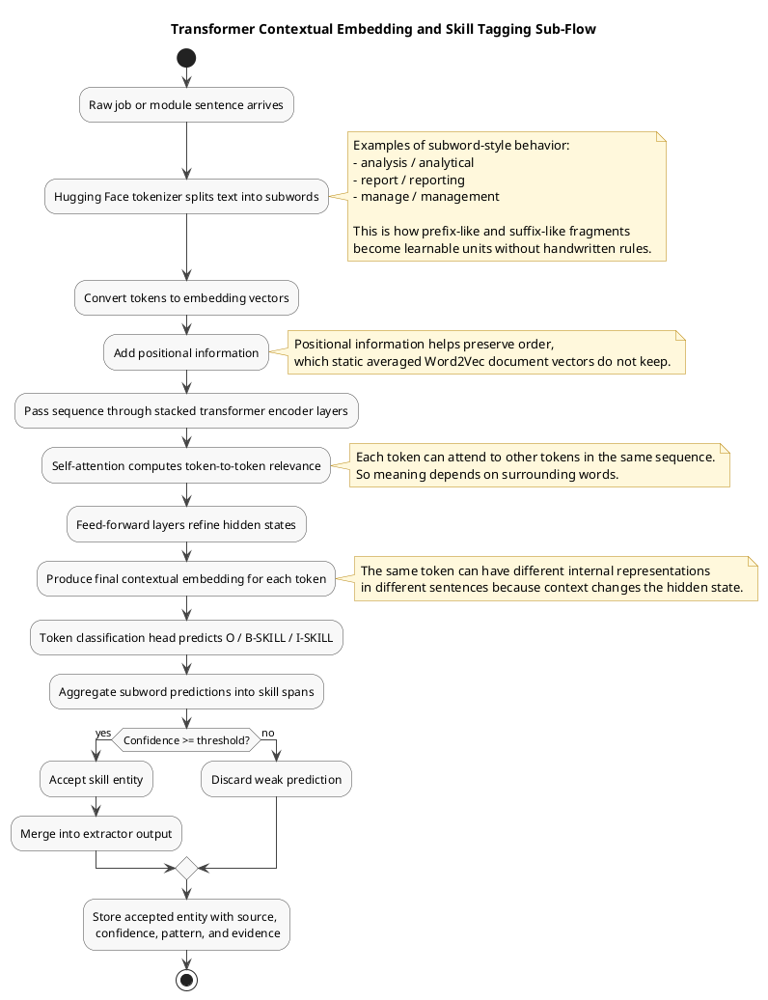
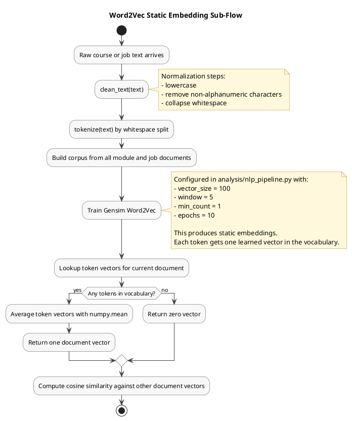

# End-to-End NLP and Skill-Matching Process Flow

Canonical methodology file for the NLP pipeline documentation in this repository.

This document describes the implemented process flow in this repository, from raw course and job text through tokenization, vector generation, skill extraction, matching, scoring, and final validation.

Important implementation note: this codebase uses two related but distinct pipelines.

1. A deterministic Word2Vec pipeline for vector training, document vectors, cosine similarity, and set-based skill gap calculation.
2. A spaCy plus optional BERT skill-extraction pipeline that detects skills, attaches evidence, records POS and phrase-pattern metadata, and contributes confidence signals to the final score.

Another important note: there is no standalone "verb function" that directly decides whether a phrase is a skill. Instead, the extractor records phrase patterns and POS signatures from spaCy spans, so verb-led structures such as `VERB NOUN` can be observed and audited as supporting evidence. This is especially useful for phrases like `change management`, `problem solving`, or `critical thinking`, where grammar contributes context.

## What the system actually does

The repository has two related but distinct NLP tracks.

1. A deterministic vector-and-gap pipeline.
  This is the lightweight baseline path in `analysis/nlp_pipeline.py`. It cleans raw text, tokenizes by whitespace after normalization, trains a Gensim Word2Vec model using a context window of 5, builds document vectors by averaging token embeddings, computes cosine similarity, and compares extracted skill sets with set intersection and set difference.

2. A richer skill-extraction and validation pipeline.
  This is the production-oriented extraction path in `analysis/spacyskillextraction.py`, `analysis/semantic_similarity.py`, and `analysis/services.py`. It uses spaCy phrase matching and entity rules, optional BERT token classification, optional noun-chunk mining, classification of skill type and tier, confidence aggregation, semantic similarity scoring, and a final verification step.

## How tokenization works in this repo

### Word2Vec tokenization

The baseline tokenizer in `analysis/nlp_pipeline.py` is intentionally simple:

1. Lowercase the text.
2. Remove non-alphanumeric characters with regex.
3. Collapse repeated whitespace.
4. Split on whitespace.

That means a sentence such as:

`"Build Power BI dashboards and analyze payroll data."`

becomes approximately:

`[build, power, bi, dashboards, and, analyze, payroll, data]`

This token list is then used to train Word2Vec and to produce average document vectors.

### spaCy tokenization

The extractor in `analysis/spacyskillextraction.py` uses spaCy tokenization when a spaCy model is available. That provides:

- token boundaries
- part-of-speech tags
- entity spans
- sentence boundaries
- dependency parse support for noun chunks

That richer tokenization is what makes `pattern` and `pos_signature` fields possible in stored `skill_entities`.

### BERT tokenization, prefixes, suffixes, and context

The BERT training and inference path in `train_bert_ner.py` and `analysis/spacyskillextraction.py` does not manually code a prefix/suffix rule. Instead, it relies on the Hugging Face tokenizer and the transformer model to learn meaning from subword structure and context.

This part of the system uses contextual embeddings. That means the vector representation of a token depends on the words around it. The same token can end up with different internal representations depending on its sentence context.

The process is:

1. The tokenizer splits text into subword pieces.
2. Prefixes, roots, and suffixes can be represented as subword units.
3. The transformer encoder reads the full token sequence with self-attention.
4. Each token representation becomes a contextual embedding influenced by surrounding tokens, not only by the token itself.
5. The token-classification head predicts BIO labels such as `B-SKILL` and `I-SKILL`.

At architecture level, the important transformer idea is:

1. input tokens are converted to embeddings
2. positional information is applied so order is not lost
3. stacked self-attention layers let each token attend to every other token in the sequence
4. feed-forward layers refine the hidden states
5. the final hidden states are passed to a token-classification layer for skill tagging

## Word2Vec algorithm used here

The implementation in `analysis/nlp_pipeline.py` uses Gensim `Word2Vec` with these key settings:

- `vector_size=100` by default
- `window=5`
- `min_count=1`
- `workers=2`
- `epochs=10`
- `seed=42`

Operationally, the flow is:

1. Build a sentence corpus from normalized token lists.
2. Train Word2Vec so words that occur in similar contexts get similar vectors.
3. For each document, collect vectors only for tokens found in the model vocabulary.
4. Compute the document vector as the mean of token vectors.
5. Compare course and job vectors using cosine similarity.

This is the static embedding part of the NLP process.

- Each token has one learned vector in the Word2Vec model vocabulary.
- The vector for a token does not change from sentence to sentence.
- `python` has one embedding, `leadership` has one embedding, and so on.
- Document meaning is approximated by averaging those static token embeddings.

So the repo contains both:

1. static embeddings from Word2Vec for lightweight semantic comparison
2. contextual embeddings from the transformer model for context-sensitive skill recognition

## Main Methodology Notes: Static vs Contextual Embeddings

The comparison table should be kept as a Markdown table rather than PlantUML. PlantUML is better for process and architecture flow, while a table is better for side-by-side properties.

| Aspect | Word2Vec in this repo | BERT / transformer in this repo |
|---|---|---|
| Embedding type | Static embeddings | Contextual embeddings |
| Main code path | `analysis/nlp_pipeline.py` | `train_bert_ner.py` and `analysis/spacyskillextraction.py` |
| Tokenization style | Clean text, then whitespace split | Hugging Face subword tokenization |
| Cleaning dependency | Strongly depends on `clean_text()` normalization | Uses raw sequence tokenization, then model context encoding |
| Token meaning | One vector per token in vocabulary | Token representation changes with sentence context |
| Word order awareness | Very weak at document level because vectors are averaged | Stronger, because positional information and self-attention preserve sequence relationships |
| Context handling | Co-occurrence learned during training, but runtime token vector is fixed | Left and right context affect each token representation at runtime |
| Best use in repo | Lightweight semantic comparison and fallback vectorisation | Context-sensitive skill span recognition |
| Output form | Token vectors and averaged document vectors | BIO token labels aggregated into skill entities |
| Main limitation | Loses syntax and detailed local context | Heavier model, depends on saved trained model and inference confidence threshold |

## Main Methodology Notes: Deep Learning Validation Role

Strictly speaking, in this repo the deep learning model is not the final system step. The final step is a verification layer in `analysis/verification.py`. The deep learning model is a high-value extraction and validation component inside the pipeline.

The order is:

1. spaCy and aliases produce high-precision deterministic matches.
2. Optional BERT NER adds contextual skill detection using deep learning.
3. Confidence thresholds filter weak BERT outputs.
4. Confidence scores are merged into final course-job ranking.
5. `verify_database(...)` performs final validation by checking suspicious records and optionally using an LLM verification layer to propose review candidates.

So the deep learning role is:

- expand recall beyond exact phrase matches
- use context to disambiguate skill meaning
- recognize multi-token skill spans with BIO labeling
- contribute confidence evidence to downstream scoring

But the final repository-level validation step is still explicit verification and review, not blind acceptance of a neural prediction.

## Main Methodology Diagram

```plantuml
@startuml
title Jobs Word2Vec + Skill Extraction + BERT Validation Flow

skinparam shadowing false
skinparam backgroundColor white
skinparam packageStyle rectangle
skinparam defaultTextAlignment left
skinparam activity {
  BackgroundColor #F8FBFF
  BorderColor #406080
  ArrowColor #406080
  DiamondBackgroundColor #FFF7E6
  DiamondBorderColor #9A6B00
}
skinparam note {
  BackgroundColor #FFFDEB
  BorderColor #B59B00
}

legend right
  This diagram reflects the implemented repository flow.
  Main paths:
  - Word2Vec: tokenization -> training -> document vector -> cosine similarity
  - Skill extraction: spaCy phrase/entity matching + optional BERT NER + optional noun chunks
  - Final validation: heuristic verification + optional Ollama review layer
endlegend

start

:Input text sources arrive;
note right
  Course side:
  - Course.modules.content
  - Course aggregate built from module content

  Job side:
  - CSV upload rows
  - Adzuna API results
  - Stored job descriptions
  - analysis_text() assembled from title, recruiter,
    category, summary, position_info, and full description
end note

partition "1. Ingestion and Assembly" {
  :Load course module text;
  :Load job advert text;
  :Assemble analysis_text blocks;
  note right
    jobs/ingestion.py builds a richer text block before skill extraction,
    combining multiple fields so the extractor sees more context than a raw title.
  end note
}

fork

partition "2A. Word2Vec Semantic Path" {
  :Normalize text with clean_text();
  note right
    analysis/nlp_pipeline.py
    - lowercase
    - remove non-alphanumeric chars
    - collapse whitespace
  end note

  :Tokenize with tokenize();
  note right
    Tokenization here is simple whitespace tokenization after normalization.
    Example:
    "Power BI dashboards and data analysis"
    -> [power, bi, dashboards, and, data, analysis]
  end note

  :Build training corpus from all course modules + all jobs;

  :Train gensim Word2Vec model;
  note right
    Implemented parameters in train_word2vec():
    - vector_size = 100 by default
    - window = 5
    - min_count = 1
    - workers = 2
    - epochs = 10
    - seed = 42

    Meaning:
    - window=5 captures nearby co-occurrence context
    - min_count=1 keeps rare domain terms
    - epochs=10 repeatedly refines embeddings
  end note

  :Learn token embeddings from co-occurrence neighborhoods;
  note right
    Word2Vec does not understand syntax explicitly.
    It learns distributional meaning:
    words used in similar contexts end up with similar vectors.

    In practical terms:
    - "forecasting" and "budgeting" may drift closer
    - "python" and "sql" may cluster in data-job contexts
    - "leadership" and "stakeholder" may cluster in management contexts
  end note

  :Generate document vectors with document_vector();
  note right
    For each document:
    1. tokenize text
    2. keep only tokens present in model.wv
    3. fetch token vectors
    4. compute mean vector with numpy.mean

    This is an average-embedding document representation.
  end note

  if (No in-vocabulary tokens?) then (yes)
    :Return zero vector of length model.vector_size;
  else (no)
    :Return mean embedding vector;
  endif

  :Compute cosine similarity between course and job vectors;
  note right
    compute_similarity(a, b)
    - if either vector is all zeros -> 0.0
    - else sklearn cosine_similarity([a], [b])
  end note
}

fork again

partition "2B. Skill Extraction Path" {
  :Initialize SpacySkillExtractor;
  note right
    Backend layering:
    - spaCy model if available
    - entity_ruler + PhraseMatcher from known skills and aliases
    - optional BERT NER backend from models/bert_skill_ner
    - optional regex fallback
    - optional noun chunk mining
  end note

  :Load canonical skill list + aliases + dynamic lexicon;
  note right
    Sources of skill vocabulary:
    - SKILL_KEYWORDS static list
    - SKILL_ALIASES synonyms
    - dynamic skills from reviewed DB entities
    - optional CSV skill lexicon

    Exclusion logic removes broad programming stack terms from the
    business-oriented regex list to reduce false positives.
  end note

  :Run spaCy document parse;
  note right
    When a full model is present, spaCy provides:
    - token boundaries
    - entity spans
    - sentence context
    - POS tags
    - dependency annotations
  end note

  :Entity ruler and PhraseMatcher scan for skill phrases;
  note right
    Exact and alias-based phrase detection examples:
    - powerbi -> power bi
    - analytical skills -> data analysis
    - stakeholder engagement -> stakeholder management
  end note

  if (BERT model available?) then (yes)
    :Run Hugging Face token-classification pipeline;
    note right
      Loaded by SpacySkillExtractor._load_bert_ner()
      if models/bert_skill_ner/skill_ner_meta.json exists.
    end note

    :BERT tokenization into subwords;
    note right
      This is where prefix/suffix information matters.
      The BERT tokenizer splits words into WordPiece subunits.

      Example concepts:
      - analytics -> analytic + ##s
      - modelling -> model + ##ling
      - automation -> auto + ##mation

      BERT does not use handcrafted prefix/suffix rules.
      Instead, subword pieces let it learn that fragments recurring
      across related words contribute to meaning.
    end note

    :Contextual encoding with self-attention;
    note right
      BERT reads each token in both left and right context.
      So meaning is influenced by neighboring words.

      Example intuition:
      - "manage stakeholders" suggests a business/soft capability
      - "manage postgres backups" suggests a technical/admin capability

      The same surface token can shift meaning because the hidden state
      is conditioned by the whole sentence.
    end note

    :Token labels predicted as O / B-SKILL / I-SKILL;
    note right
      Training script train_bert_ner.py aligns character spans to BIO labels.

      Alignment details:
      - special tokens get label -100
      - first subword in an entity gets B-SKILL or I-SKILL
      - continuation subwords can be ignored with -100
        to avoid confusing the loss
    end note

    :Aggregate token predictions into skill spans;
    :Reject predictions below confidence threshold;
    note right
      Default minimum confidence:
      BERT_SKILL_NER_MIN_CONFIDENCE = 0.65
    end note
  else (no)
    :Skip BERT stage;
  endif

  if (Noun chunk mining enabled and DEP available?) then (yes)
    :Inspect spaCy noun_chunks;
    :Promote 2-4 token chunks with skill-like heads;
    note right
      Head terms include words such as:
      - analysis
      - analytics
      - management
      - reporting
      - leadership
      - recruitment

      This creates candidate skills from noun phrases that look like
      capability expressions even when not in the seed lexicon.
    end note
  else (no)
    :Skip noun chunk mining;
  endif

  if (Regex fallback explicitly enabled?) then (yes)
    :Run regex extractor over cleaned text;
    note right
      Regex fallback is disabled by default because it can overfire.
      When enabled, it matches normalized skill phrases against the text.
    end note
  else (no)
    :Keep regex fallback off;
  endif

  :Merge all extracted evidence into one entity dictionary keyed by canonical skill;
  note right
    Each entity stores:
    - id
    - chunk_id
    - skill
    - label = SKILL
    - tier
    - skill_type
    - classification_scores
    - pattern
    - pos_signature
    - source
    - confidence
    - mentions[]
    - mention_count
  end note

  :Classify skill type and tier using classify_skill_text();
  note right
    classify_skill_text() scores tokens against lexicons for:
    - technical
    - soft
    - business
    - domain

    It also assigns tier values such as:
    - tool
    - method
    - transferable
    - candidate
    - specialized
    - capability
  end note

  :Record pattern and pos_signature for each mention;
  note right
    This is the closest thing in the codebase to a verb-based skill signal.

    How verb information helps:
    - _phrase_pattern(span) converts tokens to POS pattern sequences
    - _pos_signature(span) stores token POS tags
    - patterns like VERB NOUN or VERB can expose action-oriented phrases

    Why it matters:
    - "change management" may surface with a VERB NOUN-style structure
    - "problem solving" can express a skill through an action noun phrase
    - this supports human review and downstream interpretation

    Important limitation:
    - POS pattern metadata is stored and used as evidence
    - it is not a standalone scoring function that overrides the extractor
  end note

  :Persist skills_extracted and skill_entities to Module / JobAdvert;
}

end fork

partition "3. Gap and Coverage Calculation" {
  :For each course, union module skills into course_skills;
  :For each job, use extracted job_skills;
  :Run compute_gap(course_skills, job_skills);
  note right
    compute_gap uses set algebra:
    - matched = course_skills intersect job_skills
    - missing = job_skills minus course_skills
    - extra = course_skills minus job_skills
  end note
}

partition "4. Semantic Scoring Ensemble" {
  :Create SemanticSimilarityService;
  note right
    Backend priority:
    1. Ollama embeddings
    2. sentence-transformers
    3. Word2Vec fallback

    Even when higher-quality embedding backends exist,
    Word2Vec remains the guaranteed fallback path.
  end note

  :Vectorize modules and jobs;
  if (Embedding backend is Ollama or Sentence-BERT?) then (yes)
    :Chunk long text and embed each chunk;
    :Average normalized chunk vectors;
  else (no)
    :Use Word2Vec mean document vectors directly;
  endif

  :Compute module-to-job semantic similarity;
  :Take top module similarities and average them;
  note right
    course_job_semantic_score():
    - compute similarity for each module vector vs job vector
    - sort descending
    - average top N modules
    - N defaults to TOP_MODULE_MATCH_COUNT, usually 3
  end note

  :Compute skill coverage score;
  note right
    skill_coverage_score =
    matched_skills_count / unique_job_skills_count
  end note

  :Compute matched skill confidence score;
  note right
    _matched_skill_confidence():
    - read confidence from course skill_entities
    - read confidence from job skill_entities
    - for each matched skill, average both sides
    - average across matched skills
  end note

  :Run decision_tree_score(semantic, skill, confidence);
  note right
    Interpretable rule layer:
    - strong semantic + strong skill + strong confidence => high score
    - medium semantic with enough skill or confidence => moderate-high score
    - otherwise fallback to weighted semantic/skill blend

    This is not a learned tree from sklearn.
    It is a hand-authored decision policy encoded in Python.
  end note

  :Compute final weighted ensemble score;
  note right
    final_score combines:
    - semantic_score
    - skill_score
    - confidence_score
    - decision_tree_score

    Default weights in SemanticSimilarityService:
    - semantic_weight = 0.75
    - skill_weight = 0.25
    - confidence_weight = 0.15
    - decision_tree_weight = 0.10

    The score is normalized by total weight.
  end note

  :Store GapResult.score_breakdown and similarity_score;
}

partition "5. Skill Matrix and Frequency Analytics" {
  :Build skill matrix for jobs;
  :Build skill matrix for courses;
  note right
    build_skill_matrix():
    - extract skills from each text
    - count with Counter
    - return most_common()
  end note
}

partition "6. Deep Learning Model Training and Validation" {
  :Collect reviewed and legacy skill annotations from DB;
  note right
    analysis/course_skill_ner.py creates seed examples from:
    - module.skill_entities
    - module.skills_extracted
    - job.skill_entities
    - job.skills_extracted
  end note

  :Optionally augment with synthetic examples;
  :Convert char-span annotations to BIO token labels;
  :Fine-tune transformer token classifier;
  note right
    train_bert_ner.py supports:
    - DistilBERT
    - BERT
    - RoBERTa

    Training stages:
    1. tokenize text with offsets
    2. align char spans to tokens
    3. train with Hugging Face Trainer
    4. evaluate with seqeval
    5. save model and tokenizer
  end note

  :Evaluate with precision, recall, F1, accuracy;
  note right
    This is the deepest learned validation stage in the pipeline.
    It validates whether the model can generalize skill-boundary detection,
    beyond exact lexicon matching alone.
  end note

  :Deploy saved model to extractor as optional bert-ner backend;
  note right
    The trained model becomes a later runtime validation layer because:
    - phrase matching proposes deterministic candidates
    - BERT can confirm or add context-sensitive spans
    - low-confidence BERT spans are filtered out
  end note
}

partition "7. Final Verification Layer" {
  :Run verify_database() heuristics on stored modules and jobs;
  note right
    Heuristic verification searches for suspicious records such as:
    - long text with too few skills
    - sparse or questionable extraction coverage
    - matrix health issues
  end note

  if (LLM verification enabled?) then (yes)
    :Send suspicious records to Ollama verification pass;
    :Suggest missing skills for human review;
    note right
      Suggested skills are saved as candidate entities,
      not blindly promoted to machine-approved skills.
    end note
  else (no)
    :Use heuristic report only;
  endif

  :Human review can mark entities as reviewed, candidate, or legacy;
  note right
    This closes the feedback loop:
    reviewed labels can later feed dynamic lexicon growth and BERT retraining.
  end note
}

:Final outputs available;
note right
  Main outputs:
  - stored vectors
  - skills_extracted
  - skill_entities with evidence
  - GapResult similarity scores and breakdowns
  - SkillMatrix frequency tables
  - verification JSON and Markdown reports
end note

stop

@enduml
```

## How the verb signal helps determine skills

The repository does not implement a dedicated `verb_function()` that says "this verb means a skill." Instead, verb information is used indirectly through spaCy parsing metadata:

1. spaCy tags tokens with POS labels.
2. When a matched span is added, the extractor records `pattern` and `pos_signature`.
3. Those fields preserve grammatical shape such as `VERB`, `VERB NOUN`, or other token-type sequences.
4. Action-oriented phrases often describe capabilities, for example `problem solving`, `change management`, or `stakeholder engagement`.
5. That grammatical evidence is combined with lexicon matching, aliases, noun chunks, context terms, and BERT confidence.

So the verb signal helps determine whether a phrase looks like a capability expression, but it is one feature among several and not the sole decision-maker.

## How BERT uses prefix, suffix, meaning, and context

In this project, BERT helps by modeling context-sensitive token classification rather than by applying manual grammar rules.

1. The tokenizer splits text into subwords, which lets the model reuse meaning-bearing fragments across related words.
2. Prefix-like and suffix-like fragments contribute because the model sees subword units, not only whole words.
3. Self-attention lets each token representation depend on surrounding words on both sides.
4. The classifier predicts whether each token begins a skill, continues a skill, or is outside any skill.
5. The extractor then accepts only predictions above the configured confidence threshold.

This means BERT is the best layer in the pipeline for handling ambiguous wording and context-dependent meaning, while Word2Vec is the main lightweight semantic vector layer for document similarity.

## Appendix A: Transformer Architecture Sub-Diagram

This second PlantUML block focuses only on the transformer-based contextual embedding and skill-tagging path.

## Appendix B: Word2Vec Static Embedding Sub-Diagram

This small PlantUML block isolates the static embedding path used by `analysis/nlp_pipeline.py`.

## Reading the Diagram

The most important interpretation points are:

1. Word2Vec is the lightweight vector baseline.
  It learns co-occurrence-based word vectors and averages them into document vectors.

2. spaCy extraction is the deterministic skill backbone.
  It provides phrase-level precision and structured linguistic evidence.

3. BERT is the contextual deep learning layer.
  It helps recover skills that exact matching may miss, using subword tokenization and context-aware prediction.

4. The final match score is not pure cosine similarity.
  It is an ensemble of semantic score, skill coverage, confidence score, and a decision-tree score.

5. Final validation is explicit.
  The repo does not treat a neural prediction as automatically correct. It keeps a verification step for suspicious records and candidate review.